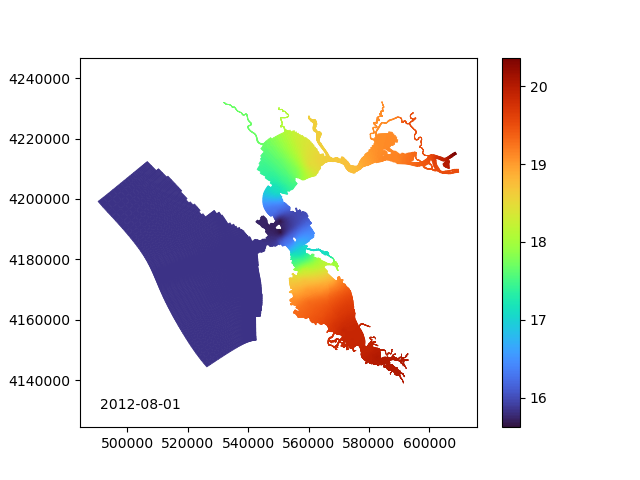
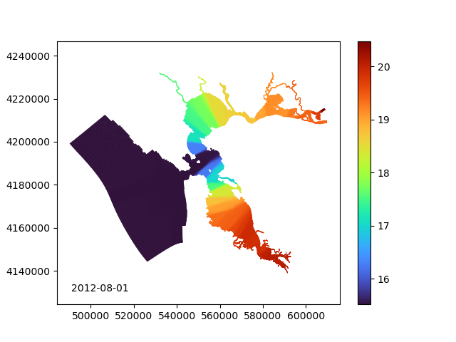
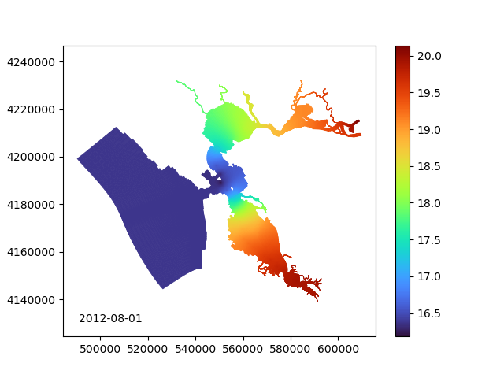

# extrapolate_to_grid
Scripts for extrapolating discrete measurements such as temperature onto a hydrodynamic grid.

This code draws on `stompy` and provides a command line interface for extrapolating data
from a set of point measurements in time and space into a continuous in time and space
dataset. The spatial component of the extrapolation respects shorelines by performing the
extrapolation on the numerical grid.

Basic usage:
```
python extrapolate_to_grid.py -g test/wy2013c_waqgeom.nc \
   -r 2012-01-01 -s 2012-08-01 -e 2013-10-01 -m -i 10D \
   -d test/dfw_temperature_1980_2014.csv -d test/test-usgs.csv
```

Sample output:



The key parameter when moving to a different grid or a source datasets with a 
different characteristic spacing between samples is the smoothin parameter
$\alpha$.  The default value, 1e-5, was used for the above plot.  Contrast
that with alpha=1e-3:



and alpha=1e-6:




While the underlying algorithm allows for altering the smoothing behavior as a function
of depth, this is not currently exposed in the command line interface.
